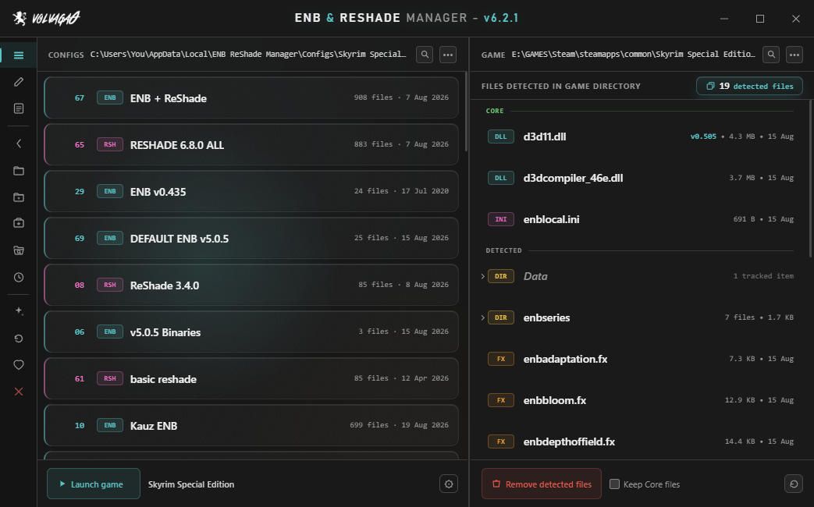
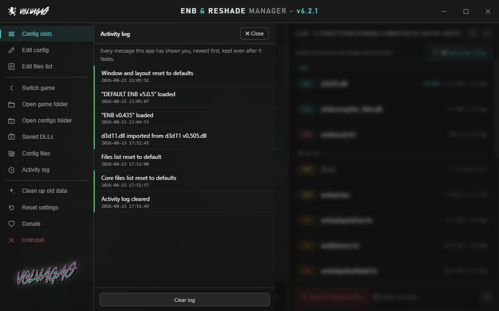
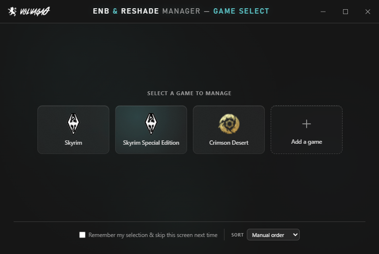

# ENB &amp; ReShade Manager

**Swap between ENB, ReShade, SweetFX and FXAA setups without copying a single file by hand.**

[**Download for Windows**](https://github.com/volvaga0/ENB-ReShade-Manager/releases/latest/download/ENB-and-ReShade-Manager.exe) · [Website](https://volvaga0.github.io/ENB-ReShade-Manager/) · [Nexus Mods page](https://www.nexusmods.com/skyrimspecialedition/mods/4143)

Version 6.2.1 · one 2.4 MB `.exe` · no installer, no dependencies to chase

---

## What this is for

Every graphics preset you install drops a pile of loose files into your game folder — a wrapper DLL, an `enbseries` folder, forty-odd `.fx` files, an `enblocal.ini` you spent an hour tuning. Trying a different preset means pulling all of that back out. Going back to the old one means remembering exactly what "all of that" was.

This app remembers for you. Save your current setup to a slot, load a different one, switch back whenever you like. It only ever touches files it knows about, that list is visible and editable, and it will not go near your saves, your mods or anything else in the folder.

I wrote the first version in 2016 because I got sick of doing it by hand. It's been in development ever since, and it's past 240,000 unique downloads on Nexus.

## Getting started

1. **Close the game.** Nothing here works properly with the game running.
2. **Run the .exe.** No install step. Put it wherever you like — Desktop, a tools folder, a USB stick.
3. **Pick your game.** Steam installs are found automatically. If yours isn't, point it at the folder yourself, or use *Add a game* for anything not in the list.
4. **Save what you already have.** Hit the save button before you change anything, so you have a way back.

That's the whole setup. From there it's load, remove, save.

## What it does

### Config slots

A slot is a snapshot of your game folder as it was — every tracked file, exactly where it sat. Save as many as you want, name them whatever you want, and drag them into whatever order makes sense to you.

Loading a slot replaces what's currently installed. If you'd rather stack one on top of another — a preset plus a separate shader pack, say — the load prompt offers **Merge** instead, which drops the slot's files in without clearing what's already there.

Double-click a slot to load it. Right-click for the rest: open its folder in Explorer, duplicate it, export it as a `.zip`, overwrite it with your current setup, or delete it.

Coloured spines down the left of each card tell you at a glance what kind of setup it is — ENB, ReShade, SweetFX, FXAA.

### Removing everything

One button strips every tracked ENB/ReShade/SweetFX/FXAA file out of the game folder and leaves you back at vanilla. Useful before installing something new, and useful when a preset misbehaves and you want a clean slate to test against.

**Keep Core files** next to the button leaves the important binaries in place — the wrapper DLL, `d3dcompiler_46e.dll`, `enblocal.ini` — so you can clear out a preset's shaders and configs without having to reinstall ENB itself afterwards. You decide what counts as "core"; right-click anything in the detected list to add or remove it.

Whatever you had before a load or a removal is kept aside automatically, and **Reload previous setup** in the bottom-right puts it back. It's saved you from a mistake more than once, including mine.

### Detected files

The right-hand panel is a live view of what's actually in your game folder right now — type, size, and when it was last modified, refreshed as things change on disk.

Folders expand in place, so you can dig down through `enbseries\`, `reshade-shaders\Textures\` or anything nested without leaving the app. Select several at once with ctrl+click, shift+click or a drag, then right-click for bulk actions. There's a search box once the list gets long enough to need one.

### Editing configs without leaving the app

**Quick Edit** reads your ENB and ReShade config files and gives you real controls for them — sliders, checkboxes, colour swatches, key-capture boxes for shader hotkeys. It understands ENB's bare `r, g, b` colour convention, and falls back to a plain text field when a value goes past 1.0 so HDR settings don't get clamped behind your back. Ctrl+Z undoes the last change.

**Raw text** mode is there when you'd rather just edit the file, with Ctrl+F search over it.

`enblocal.ini` and `ReShade.ini` get their own preset system, saved per game, so your performance and memory settings survive switching presets around.

### Drag and drop

Drag files or folders from anywhere on your PC onto the detected files panel and they're installed straight into the game folder, with their structure intact.

Drag files that the app *isn't* currently tracking onto the same panel and their names get added to the list, so from then on it can save, load and remove them along with everything else. That's the fix for a preset that ships with unusually named files — see the FAQ below.

Archives are deliberately refused. Drag a `.zip`, `.rar` or `.7z` — or files straight out of one of those windows — and the app stops and tells you, rather than dumping a folder's contents loose into your game directory. Extract first, then drop.

### Sharing a setup

**Export as .zip** packages a slot up for sending to someone else. ENB's redistributable binaries are left out on purpose — the wrapper DLL, `d3dcompiler_46e.dll`, `enbhost.exe` and `enbseries.dll` — so what you end up with is safe to upload. Whoever opens it supplies those themselves from ENBSeries, same as everyone always has. `enbhelper.dll` is included, since that one is a community project meant to be redistributed.

### Saved DLLs

Every distinct wrapper version the app sees gets quietly backed up. If you ever need to go back to an older ENB binary, or you've lost track of which version a preset wanted, it's in there — one click to drop it back into the game folder.

### Activity log

Everything the app has told you, timestamped and kept, so a toast you missed while alt-tabbed isn't gone forever. It's written to `ActionLog.txt` in plain text and capped at 500 entries.

## Supported games

Steam installs for these are detected automatically:

Skyrim · Skyrim Special Edition · Skyrim VR · Oblivion · Fallout 3 · Fallout New Vegas · Fallout 4 · The Witcher 2 · The Witcher 3 · GTA III · GTA Vice City · GTA San Andreas · GTA IV · GTA V · Deus Ex · Deus Ex: Human Revolution

Anything else, use **Add a game** and point it at the folder. It's not fussy about what the game is — if ENB or ReShade run there, this will manage them.

## Requirements

- Windows 10 or 11
- [.NET Framework 4.8](https://dotnet.microsoft.com/download/dotnet-framework/net48) — already present on any up-to-date Windows 10 or 11
- [Microsoft Edge WebView2 Runtime](https://developer.microsoft.com/microsoft-edge/webview2/) — ships with Windows 11 and with current Windows 10. The app will say so plainly if it's missing.

No admin rights needed unless your game lives somewhere that needs them, like `C:\Program Files`.

## Where it keeps things

By default, in `%LocalAppData%\ENB ReShade Manager\Configs\<game>\`. You're asked on first run and can put it somewhere else — a different drive, a synced folder, wherever — and change your mind later.

Inside that folder:

| | |
|---|---|
| `Slot1`, `Slot2`, … | your saved setups, as ordinary folders you can browse |
| `Slot Names\` | the name you gave each slot |
| `FILES.txt` | the list of filenames the app tracks. Plain text, editable in the app or in Notepad |
| `CoreFiles.txt` | your Core overrides |
| `ActionLog.txt` | the activity log |
| `Previous Setup\` | the automatic pre-load backup |

Nothing is stored in a database or a proprietary format. If you ever stop using the app, your configs are still sitting there as normal folders full of normal files.

## FAQ

**Some of my ENB files aren't being detected.**

Some presets ship with custom filenames the app has never seen. Select those files in Explorer and drag them onto the detected files panel — their names get written to the list and they're tracked from then on. It's a one-time job per preset, not something you repeat.

**Windows says it's from an unknown publisher.**

The .exe isn't code-signed — certificates cost more per year than this hobby project brings in. Click *More info* → *Run anyway*. If you'd rather not take my word for it, [VirusTotal](https://www.virustotal.com/) will take the file.

**Will it touch my mods or my saves?**

No. It only acts on the filenames in `FILES.txt`, only inside the game folder you selected. Mods, saves, load order, `.esp`s and everything else are outside what it looks at.

**Can I move my slots to another PC?**

Yes — copy the configs folder across and point the app at it. They're plain folders.

**Does it need to stay installed?**

There's nothing to install and nothing running in the background. Delete the .exe and it's gone. *Uninstall* in the sidebar clears the registry entries and remembered paths if you want to be thorough; it doesn't touch your saved configs.

**Does it work with ReShade 6.x?**

Yes. Every shader in the 6.8.0 set has been run through the Quick Edit parser.

## Getting help

Bug reports and questions are best posted on the [Nexus Mods page](https://www.nexusmods.com/skyrimspecialedition/mods/4143) — that's where the comment history lives and where I check most often. Issues here work too.

If the app ever crashes it writes a log; include that and I'll have a much better chance of fixing it quickly.

---

Made by [volvaga0](https://www.nexusmods.com/profile/volvaga0). Free, and staying that way.
